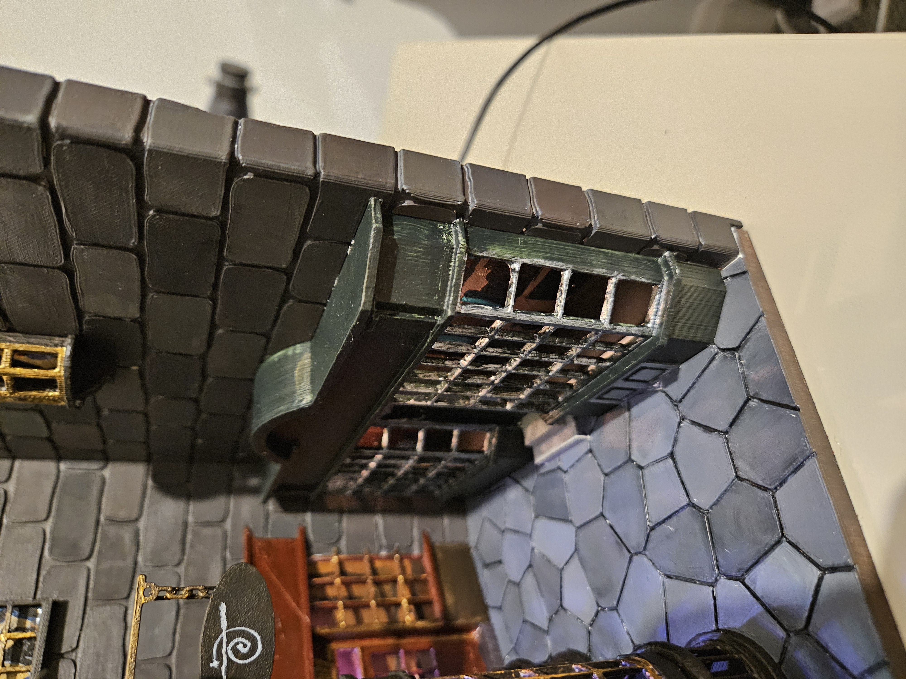

<!-- ============================= -->
<!-- Project Status Notice         -->
<!-- ============================= -->

  

    🚧 <strong>Work in Progress</strong>
  

  

    This repository is a work in progress. Expect rough edges, missing features,
    and breaking changes.
  

<h2>3D Model Attribution</h2>

The physical book nook enclosure and storefront facades used in this project are
based on the following third‑party 3D models:

<strong>Book Nook – Diagon Alley (Harry Potter)</strong> 
Designed by @Lennart_1256584 on Printables:
<a href="https://www.printables.com/model/582252-book-nook-diagon-alley-harry-potter" target="_blank">
https://www.printables.com/model/582252-book-nook-diagon-alley-harry-potter
</a>

These STL files are included in this repository for convenience and to ensure
dimensional alignment with the LED zones and firmware configuration.

<strong>Firmware, lighting logic, and system architecture are original work</strong>
and are not derived from the above models.

<h1>Diagon Alley Book Nook – LED Control Firmware</h1>

 

An Arduino-based LED control system for a <strong>Diagon Alley–themed book nook</strong>,
combining custom firmware, addressable LEDs, and 3D‑printed storefront elements
to create ambient lighting and animated “spell” effects.

This project focuses on <strong>clean firmware architecture</strong>,
<strong>predictable behaviour</strong>, and
<strong>physical–digital integration</strong>,
rather than one‑off Arduino sketches.

<h2>Project Overview</h2>

The book nook represents a small section of Diagon Alley, with individual
storefronts lit independently:

<ul>
  <li><strong>Ollivanders</strong></li>
  <li><strong>Flourish &amp; Blotts</strong></li>
  <li><strong>Quality Quidditch Supplies</strong></li>
  <li>Upstairs window lighting</li>
</ul>

The lighting system supports two primary operating modes:

<ol>
  <li>
    <strong>Ambient mode</strong> 
    Continuous, candle‑style lighting that responds smoothly to user input.
  </li>
  <li>
    <strong>Spell effects</strong> 
    Short, occasionally triggered animation sequences
    (e.g. <em>Lumos</em>, <em>Incendio</em>, <em>Wingardium&nbsp;Leviosa</em>)
    that temporarily override ambient lighting before returning to normal.
  </li>
</ol>

<h2>Hardware Summary</h2>

<ul>
  <li><strong>Microcontroller:</strong> Arduino Nano (ATmega328P)</li>
  <li><strong>LEDs:</strong> Addressable RGB LEDs (WS2812 / NeoPixel compatible)</li>
  <li><strong>Inputs:</strong> Single potentiometer for brightness and behaviour control</li>
  <li><strong>Output:</strong> Multiple LED zones representing storefronts</li>
  <li><strong>Enclosure:</strong> Custom 3D‑printed book nook with internal light channels</li>
</ul>

<h2>Firmware Architecture</h2>

This project deliberately avoids a monolithic Arduino sketch.
Instead, the firmware is divided into clear, responsibility‑based modules.

<pre>
firmware/
├── src/
│   ├── main.cpp        # System orchestration &amp; control flow
│   ├── effects.cpp     # Spell and animation effects
│   ├── storefront.cpp # Ambient storefront lighting
│   ├── scheduler.cpp  # Timing and effect scheduling
│   ├── input.cpp      # User input handling &amp; smoothing
│   └── globals.cpp    # Shared runtime state (single definition)
│
├── include/
│   ├── effects.h
│   ├── storefront.h
│   ├── scheduler.h
│   ├── input.h
│   ├── globals.h
│   └── config.h       # Centralised compile‑time configuration
</pre>

<h3>Design Goals</h3>

<ul>
  <li>
    <strong>Explicit ownership</strong> 
    Every variable has a clear owner. Shared state is declared once and referenced
    via <code>extern</code>.
  </li>
  <li>
    <strong>Separation of concerns</strong> 
    Timing, animation logic, input handling, and rendering are not interleaved.
  </li>
  <li>
    <strong>Scalability</strong> 
    New effects, inputs, or storefronts can be added without rewriting core logic.
  </li>
  <li>
    <strong>Deterministic behaviour</strong> 
    No blocking delays; all timing is based on <code>millis()</code>.
  </li>
</ul>

<h2>Key Modules Explained</h2>

<h3><code>main.cpp</code></h3>

High‑level orchestration only:

<ul>
  <li>Initialises hardware</li>
  <li>Calls input, scheduler, and rendering layers</li>
  <li>Contains no animation or timing policy logic</li>
</ul>

<h3><code>scheduler.cpp</code></h3>

Controls <strong>when</strong> spell effects:

<ul>
  <li>Start</li>
  <li>End</li>
  <li>Are rate‑limited</li>
</ul>

No LED logic exists here.

<h3><code>effects.cpp</code></h3>

Defines <strong>what spell effects look like</strong>:

<ul>
  <li>Animations modify LED buffers only</li>
  <li>No scheduling or hardware access</li>
</ul>

<h3><code>storefront.cpp</code></h3>

Handles <strong>persistent ambient lighting</strong>:

<ul>
  <li>Candle flicker</li>
  <li>Per‑storefront brightness ratios</li>
  <li>Always‑on visual baseline</li>
</ul>

<h3><code>input.cpp</code></h3>

Handles all user input:

<ul>
  <li>Potentiometer smoothing</li>
  <li>Raw input abstraction</li>
  <li>No visual logic</li>
</ul>

<h3><code>config.h</code></h3>

Single source of truth for:

<ul>
  <li>LED counts</li>
  <li>Timing limits</li>
  <li>Brightness ratios</li>
  <li>Behaviour tuning</li>
</ul>

<h2>Development Environment</h2>

<ul>
  <li><strong>IDE:</strong> Visual Studio Code</li>
  <li><strong>Build system:</strong> PlatformIO</li>
  <li><strong>Framework:</strong> Arduino (AVR)</li>
  <li><strong>Key libraries:</strong>
    <ul>
      <li>FastLED</li>
    </ul>
  </li>
</ul>

This project is intentionally <strong>PlatformIO‑native</strong>
and is not designed to be edited or built using the Arduino IDE.

<h2>3D Printed Parts</h2>

3D‑printed components for the book nook (facades, light diffusers,
structural elements) are designed alongside the firmware and align
directly with the lighting zones defined in code.

<h2>Project Status</h2>

<ul>
  <li>✅ Firmware architecture complete</li>
  <li>✅ Modular, warning‑free build</li>
  <li>✅ Stable ambient and spell behaviour</li>
  <li>✅ Suitable for long‑term extension</li>
</ul>

Potential future enhancements include:

<ul>
  <li>Additional input controls</li>
  <li>New spell effects</li>
  <li>Configuration presets</li>
  <li>Further memory and performance optimisation</li>
</ul>

<h2>License</h2>

This project is licensed under the Creative Commons
Attribution–NonCommercial 4.0 license.

You are free to use and modify this project for
non‑commercial purposes only.

Commercial use requires explicit permission from the author.
See LICENSE for details.
